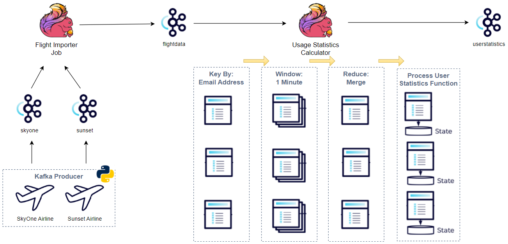

# Building Pyflink Apps

Implement the applications of the [Building Apache Flink Applications in Java](https://developer.confluent.io/courses/flink-java/overview/) course by Confluent using Pyflink.

- [Kafka Producer (Python)](./src/s05_data_gen.py)
- [Flight Importer Job (Pyflink)](./src/s16_merge.py)
- [Usage Statistics Calculator (Pyflink)](./src/s20_manage_state.py)

Unlike the course, the source data is sent by a Kafka producer application because the DataGen DataStream connector is not available in Pyflink. The other apps are implemented gradually while performing course exercises. See below for details.



## Course Contents

Below describes course contents. ✅ and ☑️ indicate exercises and course materials respectively. The lesson 3 covers how to set up Kafka and Flink clusters using Docker Compose. The Kafka producer app is created as the lesson 5 exercise. The final versions of the flight importer job and usage statistics calculator can be found as exercises of the lesson 16 and 20 respectively.

1. Apache Flink with Java - An Introduction
2. Datastream Programming
3. ✅ How to Start Flink and Get Setup (Exercise)
   - Built Kafka and Flink clusters using Docker
   - Bitnami images are used for the Kafka cluster - see [this page](https://jaehyeon.me/blog/2023-05-04-kafka-development-with-docker-part-1/) for details.
   - A custom Docker image (_building-pyflink-apps:1.17.1_) is created to install Python and the Pyflink package as well as to save dependent Jar files
     - See the [Dockerfile](./Dockerfile), and it can be built by `docker build -t=building-pyflink-apps:1.17.1 .`
   - See the [docker-compose.yml](./docker-compose.yml) and the clusters can be started by `docker-compose up -d`
4. ☑️ The Flink Job Lifecycle
   - A minimal example of executing a Pyflink app is added.
   - **See course content(s) below**
     - [s04_intro.py](./src/s04_intro.py)
5. ✅ Running a Flink Job (Exercise)
   - Pyflink doesn't have the DataGen DataStream connector. Used a Kafka producer instead to create topics and send messages.
     - 4 topics are created (_skyone_, _sunset_, _flightdata_ and _userstatistics_) and messages are sent to the first two topics.
   - **See course content(s) below**
     - [s05_data_gen.py](./src/s05_data_gen.py)
       - Topics are created by a flag argument so add it if it is the first time running it. i.e. `python src/s05_data_gen.py --create`. Basically it deletes the topics if exits and creates them.
6. Anatomy of a Stream
7. Flink Data Sources
8. ✅ Creating a Flink Data Source (Exercise)
   - It reads from the _skyone_ topic and prints the values. The values are deserialized as string in this exercise.
   - This and all the other Pyflink applications can be executed locally or run in the Flink cluster. See the script for details.
   - **See course content(s) below**
     - [s08_create_source.py](./src/s08_create_source.py)
9. Serializers & Deserializers
10. ✅ Deserializing Messages in Flink (Exercise)
    - The _skyone_ message values are deserialized as Json string and they are returned as the [named Row type](https://nightlies.apache.org/flink/flink-docs-master/api/python/reference/pyflink.common/api/pyflink.common.typeinfo.Types.ROW_NAMED.html#pyflink.common.typeinfo.Types.ROW_NAMED). As the Flink type is not convenient for processing, it is converted into a Python object, specifically [Data Classes](https://docs.python.org/3/library/dataclasses.html).
    - **See course content(s) below**
      - [s10_deserialization.py](./src/s10_deserialization.py)
11. ☑️ Transforming Data in Flink
    - _Map_, _FlatMap_, _Filter_ and _Reduce_ transformations are illustrated using built-in operators and process functions.
    - **See course content(s) below**
      - [s11_transformation.py](./src/s11_transformation.py)
      - [s11_process_function.py](./src/s11_process_function.py)
12. ✅ Flink Data Transformations (Exercise)
    - The source data is transformed into the flight data. Later data from _skyone_ and _sunset_ will be converted into this schema for merging them.
    - The transformation is performed in a function called _define_workflow_ for being tested. This function will be updated gradually.
    - **See course content(s) below**
      - [s12_transformation.py](./src/s12_transformation.py)
      - [test_s12_transformation.py](./src/test_s12_transformation.py)
        - Expected to run testing scripts individually eg) `pytest src/test_s12_transformation.py -svv`
13. Flink Data Sinks
14. ✅ Creating a Flink Data Sink (Exercise)
    - The converted data from _skyone_ will be pushed into a Kafka topic (_flightdata_).
    - Note that, as the Python Data Classes cannot be serialized, records are converted into the named Row type before being sent.
    - **See course content(s) below**
      - [s14_sink.py](./src/s14_sink.py)
15. ☑️ Creating Branching Data Streams in Flink
    - Various branching methods are illustrated, which covers _Union_, _CoProcessFunction_, _CoMapFunction_, _CoFlatMapFunction_, and _Side Outputs_.
    - **See course content(s) below**
      - [s15_branching.py](./src/s15_branching.py)
16. ✅ Merging Flink Data Streams (Exercise)
    - Records from the _skyone_ and _sunset_ topics are merged and sent into the _flightdata_ topic after being converted into the flight data.
    - **See course content(s) below**
      - [s16_merge.py](./src/s16_merge.py)
      - [test_s16_merge.py](./src/test_s16_merge.py)
17. Windowing and Watermarks in Flink
18. ✅ Aggregating Flink Data using Windowing (Exercise)
    - Usage statistics (total flight duration and number of flights) are calculated by email address, and they are sent into the _userstatistics_ topic.
    - Note the transformation is _stateless_ in a sense that aggregation is entirely within a one-minute tumbling window.
    - **See course content(s) below**
      - [s18_aggregation.py](./src/s18_aggregation.py)
      - [test_s18_aggregation.py](./src/test_s18_aggregation.py)
19. Working with Keyed State in Flink
20. ✅ Managing State in Flink (Exercise)
    - The transformation gets _stateful_ so that usage statistics are continuously updated by accessing the state values.
    - The _reduce_ function includes a window function that allows you to access the global state. The window function takes the responsibility to keep updating the global state and to return updated values.
    - **See course content(s) below**
      - [s20_manage_state.py](./src/s20_manage_state.py)
      - [test_s20_manage_state.py](./src/test_s20_manage_state.py)
21. Closing Remarks

## Start Applications

```bash
#### build docker image for Pyflink
docker build -t=building-pyflink-apps:1.17.1 .

#### create kafka and flink clusters and kafka-ui
docker-compose up -d

#### start kafka producer in one terminal
python -m venv venv
source venv/bin/activate
# upgrade pip (optional)
pip install pip --upgrade
# install required packages
pip install -r requirements-dev.txt
## start with --create flag to create topics before sending messages
python src/s05_data_gen.py --create

#### submit pyflink apps in another terminal
## flight importer
docker exec jobmanager /opt/flink/bin/flink run \
    --python /tmp/src/s16_merge.py \
    --pyFiles file:///tmp/src/models.py,file:///tmp/src/utils.py \
    -d

## usage calculator
docker exec jobmanager /opt/flink/bin/flink run \
    --python /tmp/src/s20_manage_state.py \
    --pyFiles file:///tmp/src/models.py,file:///tmp/src/utils.py \
    -d
```

## More Resources

- [Intro to the Python DataStream API](https://nightlies.apache.org/flink/flink-docs-release-1.17/docs/dev/python/datastream/intro_to_datastream_api/)
- [Flink DataStream API Programming Guide](https://nightlies.apache.org/flink/flink-docs-release-1.17/docs/dev/datastream/overview/)
- [All You Need to Know About PyFlink](https://www.alibabacloud.com/blog/all-you-need-to-know-about-pyflink_600306)
