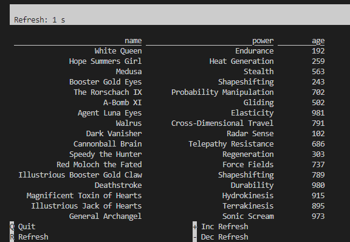

## Flink SQL Cookbook on Docker

A Flink cluster that can be used to run queries of the [Apache Flink SQL Cookbook](https://github.com/ververica/flink-sql-cookbook/tree/main) repo from Ververica.

The Flink Docker image is updated with the [Flink SQL Faker Connector](https://github.com/knaufk/flink-faker) for fake data generation. Note that the example SQL queries are based on an old version of the connector, and some of them have to be modified.

### Deploy a Flink Cluster

```bash
# start services
$ docker compose up -d

# list services
$ docker-compose ps
# NAME                COMMAND                  SERVICE             STATUS              PORTS
# jobmanager          "/docker-entrypoint.…"   jobmanager          running (healthy)   6123/tcp, 0.0.0.0:8081->8081/tcp, :::8081->8081/tcp
# taskmanager-1       "/docker-entrypoint.…"   taskmanager-1       running             6123/tcp, 8081/tcp
# taskmanager-2       "/docker-entrypoint.…"   taskmanager-2       running             6123/tcp, 8081/tcp
# taskmanager-3       "/docker-entrypoint.…"   taskmanager-3       running             6123/tcp, 8081/tcp
```

### Start a SQL Client

```bash
$ docker exec -it jobmanager /opt/flink/bin/sql-client.sh
```


### Run a Query

**Create a temporary table**

```sql
CREATE TEMPORARY TABLE heros (
  `name` STRING,
  `power` STRING,
  `age` INT
) WITH (
  'connector' = 'faker',
  'fields.name.expression' = '#{superhero.name}',
  'fields.power.expression' = '#{superhero.power}',
  'fields.power.null-rate' = '0.05',
  'fields.age.expression' = '#{number.numberBetween ''0'',''1000''}'
);
-- [INFO] Execute statement succeeded.
```

**Check the new table**

```sql
SHOW TABLES;
-- +------------+
-- | table name |
-- +------------+
-- |      heros |
-- +------------+
-- 1 row in set
```

**Query the new table**

```sql
SELECT * FROM heros;
```



**Stop the SQL client**

```sql
quit;
```
